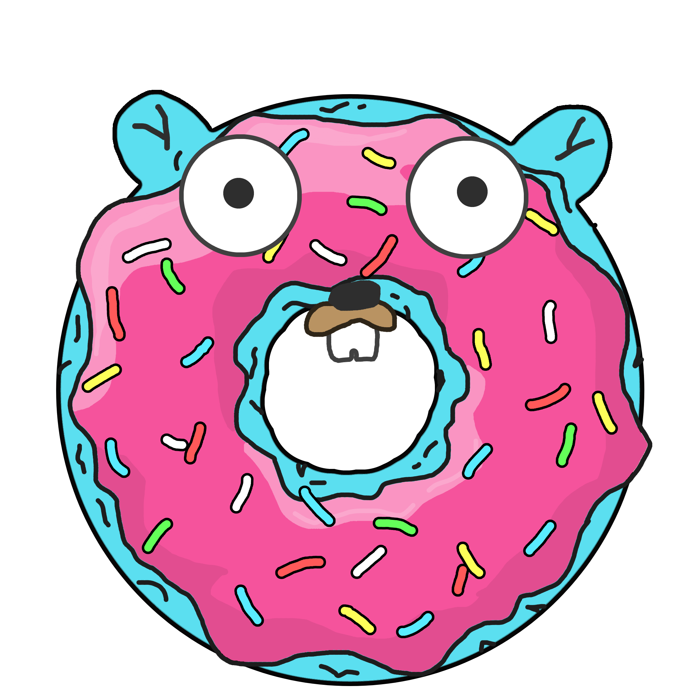

# GoNut

A go version of [hadal1337/ASCII-Doughnut](https://github.com/hadal1337/ASCII-Doughnut) which is itself a C++ version of [a1k0n.net's `donut.c`](https://www.a1k0n.net/2011/07/20/donut-math.html).

It was also a great opportunity to make a gopher donut (to be honest it's the main reason I made this.)

    
    

